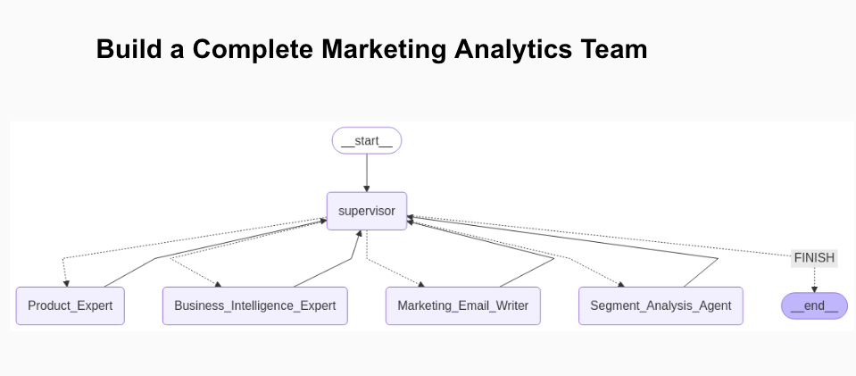

# AI Marketing Analytics Team — Multi-Agent System

> **DS4B 301P · Project 3** — Generative AI and LLMs for Data Scientists (Business Science University)

A production-ready **multi-agent AI system** that acts as a full marketing analytics department. A Supervisor agent routes natural-language questions to a team of specialized sub-agents, which together handle customer segmentation, product recommendations, SQL-powered business intelligence, and personalised email campaigns.



---

## Key Features

| Capability | Agent | Technology |
| --- | --- | --- |
| Customer segmentation & analysis | Customer Segmentation Agent | LangGraph + pandas + scikit-learn |
| Product Q&A from a catalogue | Product Expert Agent | RAG — ChromaDB + OpenAI Embeddings |
| Revenue / leads SQL analytics | Business Intelligence Agent | SQLAlchemy + GPT-4 text-to-SQL |
| Personalised email generation | Marketing Email Writer Agent | Prompt engineering + LangChain |
| Product recommendations per segment | Customer Recommender Agent | LangGraph + pandas |
| Multi-agent orchestration | Supervisor Agent | LangGraph StateGraph |
| Web interface | Streamlit App | Streamlit + Plotly |

---

## Project Structure

```text
.
├── 01_generate_customer_segmentation.py   # Generate & store customer segments in the DB
├── 02_customer_segmentation_agent.py      # Standalone segmentation agent demo
├── 03_product_expert_RAG.py               # RAG product expert demo
├── 04_business_intelligence_SQL.py        # SQL BI agent demo
├── 05_marketing_email_writer_prompt_eng.py # Email writer demo
├── 06_marketing_analytics_supervisor_and_team.py  # Full team demo (notebook-style)
├── 07_marketing_analytics_team_app.py     # Streamlit web application
├── 08_customer_recommender_agent.py       # Product recommender per segment
│
├── marketing_analytics_team/
│   ├── teams.py                           # Assembles all agents into one LangGraph team
│   └── agents/
│       ├── supervisor_agent.py
│       ├── customer_segmentation_agent.py
│       ├── business_intelligence_agent.py
│       ├── marketing_email_writer_agent.py
│       ├── product_expert.py
│       └── utils.py
│
├── data/
│   ├── database-sql-transactions/         # SQLite: leads, transactions, products
│   └── data-rag-product-information/      # ChromaDB vector store for product catalogue
│
├── challenges/                            # Exercises and solutions
├── credentials.yml.example               # API key template (copy → credentials.yml)
├── environment_ds4b_301p_dev_matt.yml    # Full conda environment snapshot
└── additional-requirements.txt           # Extra pip packages
```

---

## Architecture

```text
User Question
     │
     ▼
┌─────────────────────┐
│   Supervisor Agent  │  ← routes the question to the right specialist
└────────┬────────────┘
         │
   ┌─────┴──────────────────────────────────────┐
   │             │              │                │
   ▼             ▼              ▼                ▼
Customer    Product Expert  Business       Marketing Email
Segmentation    (RAG)       Intelligence    Writer Agent
  Agent                      Agent (SQL)
```

All agents share a `StateGraph` (LangGraph) with short-term memory via `MemorySaver`, so the team can hold a multi-turn conversation.

---

## Setup

### 1. Create the conda environment

```bash
conda env create -f environment_ds4b_301p_dev_matt.yml
conda activate ds4b_301p_dev
pip install -r additional-requirements.txt
```

### 2. Add your OpenAI API key

```bash
cp credentials.yml.example credentials.yml
```

Open `credentials.yml` and replace the placeholder with your actual key from [platform.openai.com/api-keys](https://platform.openai.com/api-keys).

> **Security note:** `credentials.yml` is listed in `.gitignore` and will never be committed.

### 3. Generate the customer segmentation data

Run this once to populate the SQLite database with scored leads and segments:

```bash
python 01_generate_customer_segmentation.py
```

---

## Running the Project

### Streamlit web app (recommended)

```bash
streamlit run 07_marketing_analytics_team_app.py
```

Then open [http://localhost:8501](http://localhost:8501) in your browser.

**Example questions to ask the team:**

- *"Give me a summary of our customer segments and their value."*
- *"What are the top-selling products for our high-value customers?"*
- *"Write a promotional email for segment 1 focused on our premium courses."*
- *"Show me total revenue by segment for the last 6 months."*

### Individual agent scripts

Each numbered script (`02_` → `08_`) can be run standalone to demo a specific agent.

```bash
python 02_customer_segmentation_agent.py
python 08_customer_recommender_agent.py
```

---

## Models Used

| Task | Model |
|---|---|
| Agent reasoning & generation | `gpt-4.1-mini` |
| Product catalogue embeddings | `text-embedding-ada-002` (OpenAI) |

Swap models by changing the `MODEL` constant at the top of any script or by passing a different model name to `make_marketing_analytics_team()`.

---

## Dependencies

Key libraries (see `environment_ds4b_301p_dev_matt.yml` for full pinned versions):

- `langchain`, `langchain-openai`, `langchain-community`
- `langgraph <= 1.0.0`
- `chromadb` — vector store for product RAG
- `sqlalchemy` — SQL BI agent database access
- `streamlit`, `plotly` — web application
- `pandas`, `scikit-learn` — data processing and segmentation
